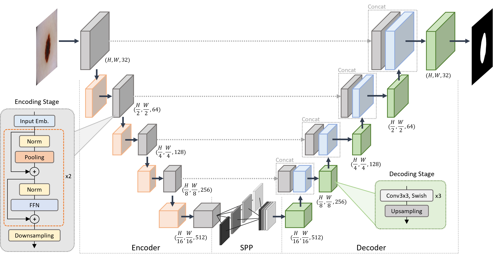
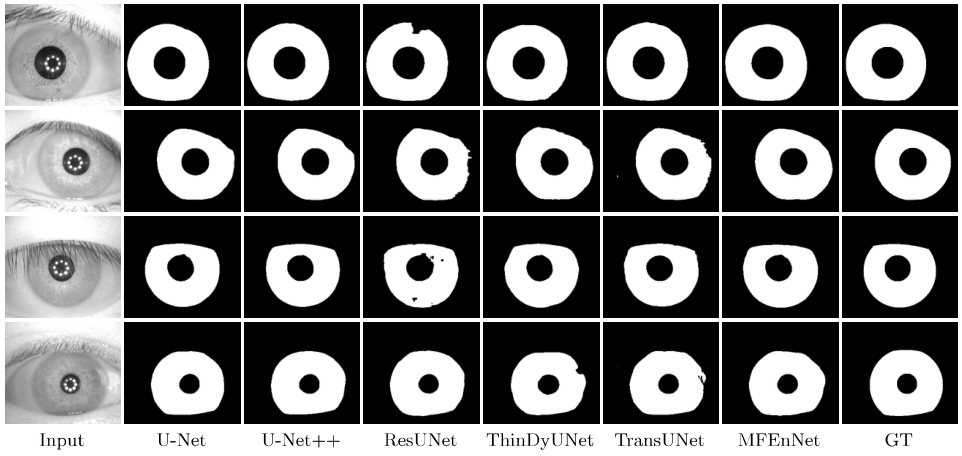
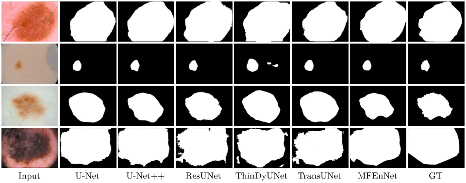

# MFEnNet: MetaFormer-driven Encoding Network for Robust Medical Semantic Segmentation

[](https://arxiv.org/abs/2601.00922)
[](https://link.springer.com/chapter/10.1007/978-3-032-23716-3_14)

The official implementation of the paper [MetaFormer-driven Encoding Network for Robust Medical Semantic Segmentation](https://arxiv.org/abs/2601.00922) (MCT4SD 2025).

## Introduction

### Architecture

<p align="center">

</p>

### Results

<p align="center">

</p>

<p align="center">

</p>

## Train

```
python train.py
```

## Citation
```bibtex
@inproceedings{tran2025metaformer,
  title={MetaFormer-Driven Encoding Network for Robust Medical Semantic Segmentation},
  author={Tran, Le-Anh and Tran, Chung Nguyen and Dang, Nhan Cach and Quoc, Anh Le Van and Carrabina, Jordi and Castells-Rufas, David and Nguyen, Minh Son},
  booktitle={International Conference on Machine and Computing Technologies for Sustainable Development},
  pages={141--151},
  year={2025},
  organization={Springer}
}
```

Have fun!

LA Tran
